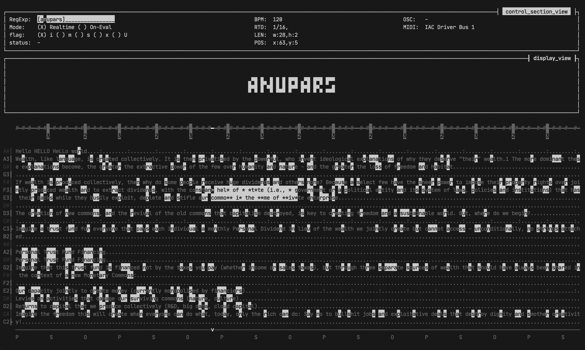

# [ WIP ]

an attempts for porting `anu` to pure `Rust` language
purposely to run on low-powered machine or embedded system

# building

- for now only `Microcontroller - Raspberry Pi 4B` (64Bit OS) is supported.
- before building you will need to install `Docker` first
- then just run `sh ./build`
- finger-crossed

# credits

- font-face: [Departure Mono](https://departuremono.com/)

# run

desktop (default): `cargo run`
microcontroller: `cargo run --no-default-features --features microcontroller`

# build
desktop (default): `cargo build --release`
microcontroller: `cargo build --release --no-default-features --features microcontroller`