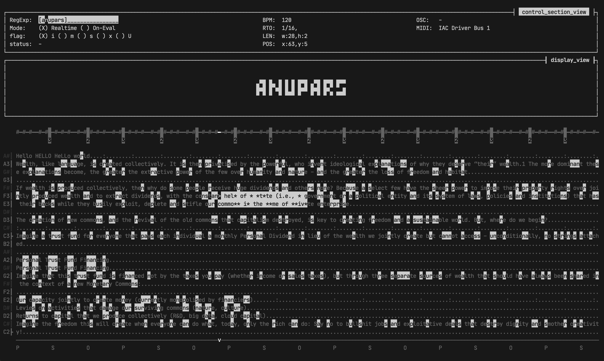

# anupars

anupars (อนุภา(ส), meaning "tiny following light" in Thai), a Rust-based reimagining of [`anu`](https://github.com/karnpapon/anu) a musical sequencer driven by regular expressions, designed to operate on resource-constrained devices, and performance-oriented.

> [!WARNING]
> This project is a **work in progress**. Features and APIs are subject to change anytime.

# Features

- **MIDI Out Selector**
  - Choose from available MIDI output devices for flexible routing to synths, DAWs, or hardware.

- **MIDI Out Clock Features**
  - Implements standard MIDI clock transport messages for external device:
    - `Start` Sends MIDI Start (`0xFA`) to begin playback from the start.
    - `Stop` Sends MIDI Stop (`0xFC`) to halt playback.
    - `Tick` Sends MIDI Clock (`0xF8`) for timing synchronization (24 per quarter note ([PPQN](https://en.wikipedia.org/wiki/MIDI_beat_clock))).
    - `Continue` Sends MIDI Continue (`0xFB`) to resume playback from the current position.
    - `Song Position Pointer` (SPP) Sends MIDI Song Position Pointer (`0xF2`) to set the playback position in beats.

- **Keyboard MIDI Layout**
  - The on-screen keyboard uses a spatial layout similar to Laurie Spiegel's [Music Mouse](https://en.wikipedia.org/wiki/Music_Mouse), enabling expressive, algorithmic play.

- **Separated Scale Change for Vertical/Horizontal Steps**
  - Independently assign musical scales for vertical (Y-axis) and horizontal (X-axis) movement, allowing complex modal and harmonic explorations.

- **Movement**
  - Instantly change running direction of the sequencer, creating evolving or retrograde patterns at the touch.
    - Forward
    - Reverse
    - Pendulum
    - Random

- **Arpeggiator Mode**
  - When enabled, the sequencer steps only through positions matching the current regex, producing arpeggiator-like melodic patterns from your rules.

- **Generated Text Content (Dissociative Press Algorithm)**
  - Generate new musical or textual material using the Dissociative Press algorithm, for creative pattern mutation and generative composition.
  - Manaul file loader TBD

- **Accumulation Mode (Semi Self-Configuration)**
  - Activate accumulation mode to let the system semi-autonomously reconfigure itself via [Queue System](#queue-system), stacking and evolving patterns for emergent musical results.

- **Modes** (shown in status bar; uppercase = active)
  - `a`: Arpeggiator (see above)
  - `n`: Drain Queue
  - `u`: Accumulation (see above)
  - `l`: Dynamic Length, playhead length adjusts dynamically.
  - `e`: Event Operator, enables event operator triggering from keyboard.
  - `s`: Sweep, sweeps through positions across the playhead range.

- **Scale Selection**
  - 16 scales available: `Chromatic`, `Major`, `Minor`, `Harmonic Minor`, `Melodic Minor`, `Dorian`, `Phrygian`, `Lydian`, `Mixolydian`, `Locrian`, `Major Pentatonic`, `Minor Pentatonic`, `Blues`, `Whole Tone`, `Diminished`, and **Thai 7-TET** (microtonal).
  - Scale root selectable across all 12 chromatic pitches (C–B).

# Queue System

Inpspired by [Event Loop](https://medium.com/@ignatovich.dm/the-javascript-event-loop-explained-with-examples-d8f7ddf0861d), the queue is a first-in-first-out (`FIFO`) dispatch mechanism, events accumulate, wait, and are consumed one at a time, each driving a state transition in the sequencer. every jump or timbral gesture is the result of something that was previously enqueued.

it comprised of 
- **Event Queue (EVQ)** holds pending event operators to be fused into the next push, current available ops are
  - `c` / `>CHORD` chord event triggers a triad on the next matched position.
  - `h` / `>HOLDN` hold event sustains the note on the next matched position.
- **Queue Operators** spatially mapped on keyboard, current available ops are
  - `P` Push, push current playhead position (or front event) onto OPQ.
  - `S` Swap, swap the top two items in OPQ.
  - `O` Pop, execute and remove the front item from OPQ.
  - `D` Duplicate, duplicate the top item in OPQ.

# Building
- Docker must be installed before proceeding
- Execute: `sh ./build`
- finger-crossed

**Supported Platforms:**
- Desktop: Linux, macOS, Windows (x86_64, ARM64)
- Embedded: Raspberry Pi 4B (aarch64-unknown-linux-gnu)

# Running

- Desktop mode (default): `cargo run`
- Microcontroller mode: `cargo run --no-default-features --features microcontroller`

# Compilation
- Desktop mode (default): `cargo build --release`
- Microcontroller mode: `cargo build --release --no-default-features --features microcontroller`

# Credits

- Typography: [Departure Mono](https://departuremono.com/)
