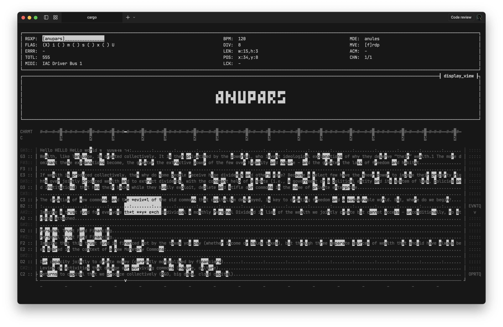

<div align="center">

[](https://github.com/karnpapon/anupars/actions/workflows/build.yml)
[](https://github.com/karnpapon/anupars/actions/workflows/release.yml)

</div>

# anupars


anupars (อนุภา(ส), meaning "tiny following light" in Thai), a Rust-based reimagining of [`anu`](https://github.com/karnpapon/anu) a musical sequencer driven by regular expressions, designed to operate on resource-constrained devices, and performance-oriented.

> [!WARNING]
> This project is a **work in progress**. Features and APIs are subject to change anytime.



# Getting Started

## Prerequisites

- A MIDI-capable application or device connected

## Option A — Download a pre-built binary (easiest)

1. Go to the [Releases page](https://github.com/karnpapon/anupars/releases) and download the archive for your platform.
2. Extract and make the binary executable:

```sh
# macOS only, remove quarantine set by Gatekeeper on downloaded binaries
xattr -d com.apple.quarantine ./anupars
chmod +x ./anupars
./anupars
```

```powershell
# Windows — just double-click anupars.exe, or run from PowerShell:
.\anupars.exe
```

## Option B — Build from source

Requires the [Rust toolchain](https://rustup.rs/) (stable).

```sh
git clone https://github.com/karnpapon/anupars.git
cd anupars
cargo run
```

## Quick Start

1. **Open the menubar** with `Ctrl+b`, the menubar will be shown at the top of terminal screen.
2. **Click "anupars" > "Generate Text"**, enter a length for the generated text, then hit `Enter`, this fills the grid editor with content (you can also provide your own text in `Insert File` below `Generate Text` menu).
3. **Click `anupars` > `MIDI`** ensure you select the right MIDI output.
4. **Type a regex**, the matching cells are highlighted on the grid in real time.
5. **Press `Esc`** to switch between the regex input and the grid editor section (there's a little indicator to tell which section is currently selected).
6. the playhead will be initialises at position (0, 0) top-left (since it initialized with len=1 so you might trying to look for it).
7. **Move the playhead** with `h / j / k / l` (vim-style) or click directly on the canvas.
8. **Scale playhead** with `Shift` modifier key, along with move key (`h / j / k / l`) or just mouse dragging.
9. **Leap playhead** similar to how `Orca` leap, you can use modifier key `Alt` (or `Option` in osx) combine with move key and scale key.
10. **Press `Space`** to start playback, the playhead steps through cells that match your pattern (try increasing beat division by `}` if you want to make it faster).
11. **Change tempo** with `>` (faster) and `<` (slower).
12. to enable mode use `Ctrl` along with available mode chars (`a`, `n`, `u`, `e`, `s`,`y`, `z` you can easily see theses being displayed on the top of the screen) let's start with `sweep` mode using `Ctrl+s` the active mode with change from lowercase to uppercase mode the crosshair appears and it'll trigger all the trigger point along y-axis (the velocity is based-on the trigger point distance to the playhead (in y-axis), the far from playhead, the lower velocity), all modes is togglable all default to off initially.
13. the top spatial keyboard layout (inspired by Music Mouse - Laurie Spiegel) will hint you what note is being triggered, whre 
  - `#` represent black-key  
  - `━` represent white-key 
  - long-vertical represent natural C 
  - the number in long-vertical key is an octave
14. try changing scale by `Shift+Plus` (scale up) or `Shift+Underscore` (scale down)
15. changing root note by `=` (root note up) or `-` (down)


That's all you need for a first session. Explore [Features](#features) and [Keybindings](#keybindings-reference) whenever you're ready to go deeper.

---

# Features

- **Tiny Binary Size**
  - Optimized for minimal footprint (~855 KB) - release builds use `opt-level = "z"`, `lto`, and symbol stripping, producing a small self-contained binary suitable for resource-constrained devices.

- **MIDI In/Out Selector**
  - Choose from available MIDI devices for flexible routing to synths, DAWs, or hardware.

- **MIDI In (Clock Sync)**
  - When MIDI input clock messages are enabled (default: `disabled`), the app will listen for incoming MIDI `Start/Stop/Continue/Clock` messages and synchronize playback to an external master clock.
  - **Note**: enabling MIDI input clock-sync disables the spacebar `play/pause` control to avoid conflicting local and external transport control. Disable MIDI input if you want to use the spacebar locally.

- **MIDI Out Clock Features**
  - Implements standard MIDI clock transport messages for external device:
    - `Start` Sends MIDI Start (`0xFA`) to begin playback from the start.
    - `Stop` Sends MIDI Stop (`0xFC`) to halt playback.
    - `Tick` Sends MIDI Clock (`0xF8`) for timing synchronization (24 per quarter note ([PPQN](https://en.wikipedia.org/wiki/MIDI_beat_clock))).
    - `Continue` Sends MIDI Continue (`0xFB`) to resume playback from the current position.
    - `Song Position Pointer` (SPP) Sends MIDI Song Position Pointer (`0xF2`) to set the playback position in beats.

- **Keyboard MIDI Layout**
  - The on-screen keyboard uses a spatial layout similar to Laurie Spiegel's [Music Mouse](https://en.wikipedia.org/wiki/Music_Mouse), enabling expressive, algorithmic play.

- **Separated Scale Change for Vertical/Horizontal Steps**
  - Independently assign musical scales for vertical (Y-axis) and horizontal (X-axis) movement, allowing complex modal and harmonic explorations.

- **Movement**
  - Instantly change running direction of the sequencer, creating evolving or retrograde patterns at the touch.
    - Forward
    - Reverse
    - Pendulum
    - Random

- **Arpeggiator Mode**
  - When enabled, the sequencer steps only through positions matching the current regex, producing arpeggiator-like melodic patterns from your rules.

- **Generated Text Content (Dissociative Press Algorithm)**
  - Generate new musical or textual material using the Dissociative Press algorithm, for creative pattern mutation and generative composition.
  - Manaul file loader TBD

- **Accumulation Mode (Semi Self-Configuration)**
  - Activate accumulation mode to let the system semi-autonomously reconfigure itself via [Queue System](#queue-system), stacking and evolving patterns for emergent musical results.


- **Modes** (shown in status bar; uppercase = active)
  - `a`: Arpeggiator (see above)
  - `n`: Drain Queue
  - `u`: Accumulation (see above)
  - `e`: Event Operator, enables event operator triggering from keyboard.
  - `s`: Sweep, sweeps through positions across the playhead range.
  - `y`: Dynamic Length, playhead length adjusts dynamically.
  - `z`: Freeze, locks the active position and retriggers MIDI at that cell each DIV tick (it's quantized to the beat).

- **Sweep Tilt (TLT)**
Controls the angle of the sweep crosshair. **this mode should be used with "Sweep" mode**, it moves like a "Bishop" movement in chess. Each triggered cell fires on the MIDI channel matching its visual column band
Cycles through three modes displayed in the status bar:
    - `|` Vertical (default): crosshair sweeps straight down, same column for every row.
    - `\` DiagDown: crosshair shifts one column right per row below the playhead, left per row above (like a `\` diagonal).
    - `/` DiagUp: crosshair shifts one column left per row below the playhead, right per row above (like a `/` diagonal).

- **Sweep Row Mode**
Filters which rows the sweep crosshair draws on and triggers MIDI from. **requires Sweep mode to be active**. The active sub-mode is shown inline in the mode status bar after the `S` character (e.g. `S<O>`).
Cycles through four modes with `|`:
    - Normal (default): every row is active — identical to previous sweep behaviour.
    - `O` Odd rows only (rows 1, 3, 5 …): even rows are silenced and not rendered.
    - `E` Even rows only (rows 0, 2, 4 …): odd rows are silenced and not rendered.
    - `R` Random: each row is independently gated by a deterministic hash of its index, producing a fixed sparse pattern.

- **Scale Selection**
  - Scale root selectable across all 12 chromatic pitches (C–B).

  | # | Scale | Notes |
  |---|---|---|
  | 1 | `Chromatic` | |
  | 2 | `Major` | |
  | 3 | `Minor` | |
  | 4 | `Harmonic Minor` | |
  | 5 | `Melodic Minor` | |
  | 6 | `Dorian` | |
  | 7 | `Phrygian` | |
  | 8 | `Lydian` | |
  | 9 | `Mixolydian` | |
  | 10 | `Locrian` | |
  | 11 | `Major Pentatonic` | |
  | 12 | `Minor Pentatonic` | |
  | 13 | `Blues` | |
  | 14 | `Whole Tone` | |
  | 15 | `Diminished` | |
  | 16 | `Thai 7-TET` | microtonal |


# Queue System

Inpspired by [Event Loop](https://medium.com/@ignatovich.dm/the-javascript-event-loop-explained-with-examples-d8f7ddf0861d), the queue is a first-in-first-out (`FIFO`) dispatch mechanism, events accumulate, wait, and are consumed one at a time, each driving a state transition in the sequencer. every jump or timbral gesture is the result of something that was previously enqueued.

it comprised of 
- **Event Queue (EVQ)** holds pending event operators to be fused into the next push, current available ops are
  - `c` / `>CHORD` chord event triggers a triad.
  - `h` / `>HOLDN` hold event sustains the note.
  - `r` / `>RTCHT` ratheting (re-triggering) the note.
- **Queue Operators** spatially mapped on keyboard, current available ops are
  - `P` Push, push current playhead position (or front event) onto OPQ.
  - `S` Swap, swap the top two items in OPQ.
  - `O` Pop, execute and remove the front item from OPQ.
  - `D` Duplicate, duplicate the top item in OPQ.

# Keybindings Reference

## Playhead Movement

| Key | Action | Description |
|-----|--------|-------------|
| `h` | Move Left | Move playhead 1 step left |
| `j` | Move Down | Move playhead 1 step down |
| `k` | Move Up | Move playhead 1 step up |
| `l` | Move Right | Move playhead 1 step right |
| `Ctrl+h` | Aim Left (preview) | Hold to preview a left jump, press any movement key to commit |
| `Ctrl+j` | Aim Down (preview) | Hold to preview a down jump, press any movement key commit |
| `Ctrl+k` | Aim Up (preview) | Hold to preview an up jump, press any movement key commit |
| `Ctrl+l` | Aim Right (preview) | Hold to preview a right jump, press any movement key commit |
| `Option+h` / `Alt+h` | Leap Left | Jump 5 steps left |
| `Option+j` / `Alt+j` | Leap Down | Jump 5 steps down |
| `Option+k` / `Alt+k` | Leap Up | Jump 5 steps up |
| `Option+l` / `Alt+l` | Leap Right | Jump 5 steps right |

> **Note (macOS):** Option+hjkl produces Unicode characters (`˙`, `∆`, `˚`, `¬`) which are automatically mapped.

## Playhead Area Adjustment

| Key | Action | Description |
|-----|--------|-------------|
| `Shift+h` / `H` | Scale Left | Decrease area width by 1 |
| `Shift+j` / `J` | Scale Down | Decrease area height by 1 |
| `Shift+k` / `K` | Scale Up | Increase area height by 1 |
| `Shift+l` / `L` | Scale Right | Increase area width by 1 |
| `Shift+Option+h`* | Scale Left (Large) | Decrease area width by 8 |
| `Shift+Option+j`* | Scale Down (Large) | Decrease area height by 8 |
| `Shift+Option+k`* | Scale Up (Large) | Increase area height by 8 |
| `Shift+Option+l`* | Scale Right (Large) | Increase area width by 8 |

> **Note (macOS only):** Shift+Option combinations produce Unicode characters (`Ó`, `Ô`, ``, `Ò`) for large scale adjustments.

## Grid Configuration

| Key | Action | Description |
|-----|--------|-------------|
| `0` or `1` | 1×1 Grid | Single cell (no splits) |
| `2` | 2×1 Grid | 2 vertical splits |
| `3` | 3×1 Grid | 3 vertical splits |
| `4` | 4×1 Grid | 4 vertical splits |
| `5` | 4×2 Grid | 4×2 grid (8 cells) |
| `6` | 4×3 Grid | 4×3 grid (12 cells) |
| `7` | 4×4 Grid | 4×4 grid (16 cells) |

## Playback Control

| Key | Action | Description |
|-----|--------|-------------|
| `Space` | Toggle Play/Pause | Start or stop playback |
| `Ctrl+f` | Toggle Forward | Enable forward playback mode |
| `Ctrl+r` | Toggle Reverse | Enable reverse playback mode |
| `Ctrl+d` | Toggle Random | Enable random playback mode |
| `Ctrl+p` | Toggle Pendulum | Enable pendulum playback mode |

## Modes

| Key | Action | Description |
|-----|--------|-------------|
| `Ctrl+a` | Toggle Arpeggiator | Enable/disable arpeggiator mode |
| `Ctrl+u` | Toggle Accumulation | Enable/disable queue accumulation |
| `Ctrl+e` | Toggle Event Operator | Enable/disable event operators |
| `Ctrl+n` | Toggle Drain Queue | Enable/disable queue draining |
| `Ctrl+s` | Toggle Sweep | Enable/disable sweep mode |
| `Shift+\|` | Cycle Sweep Row Mode (SWP) | Cycle sweep row filter: `Nrm` → `Odd` → `Even` → `Rnd` |
| `Ctrl+t` | Cycle Tilt (TLT) | Cycle sweep crosshair angle: `\|` → `/` → `\` |
| `Ctrl+y` | Toggle Dynamic Length | Enable/disable dynamic length mode |
| `Ctrl+z` | Toggle Freeze | Lock active position; retrigger matched cell at current DIV rate |

## Tempo & Timing

| Key | Action | Description |
|-----|--------|-------------|
| `>` | Increase BPM | Speed up tempo |
| `<` | Decrease BPM | Slow down tempo |
| `}` | Increase Ratio | Increase timing ratio |
| `{` | Decrease Ratio | Decrease timing ratio |

## Scale & Musical Settings

| Key | Action | Description |
|-----|--------|-------------|
| `Shift++` / `Shift+Plus` | Cycle Scale Mode Up | Next musical scale |
| `Shift+_` / `Shift+Underscore` | Cycle Scale Mode Down | Previous musical scale |
| `=` / `Equal` | Increase Root Note | Next root note |
| `-` / `Minus` | Decrease Root Note | Previous root note |

## UI & Navigation

| Key | Action | Description |
|-----|--------|-------------|
| `Ctrl+b` | Show Menubar | Display/access menu |
| `Esc` | Toggle Input Mode | Switch between regex input and canvas |
| `q` | Quit | Exit application |

## Mouse Controls

| Action | Description |
|--------|-------------|
| **Click** | Set playhead position to clicked location |
| **Click+Drag** | Adjust playhead area size by dragging |

---

## Platform Notes

- **macOS**: Option key (⌥) is used for leap and large scale adjustments
- **Linux/Windows**: Alt key behaves similarly to Option on macOS for leap functions
- **Cross-platform**: Vim-style hjkl keys work consistently across all platforms

## Implementation Details

- Arrow keys have been removed in favor of vim-style navigation
- Platform-specific key combinations use `#[cfg(target_os = "macos")]` compilation flags
- Minimum playhead area size is enforced (1×1) to prevent overflow errors


# Credits

- *Un coup de dés jamais n'abolira le hasard* (A Throw of the Dice Will Never Abolish Chance) — Stéphane Mallarmé (1897)
  English translation by Peter G. Doyle, via [Wikisource](https://en.wikisource.org/wiki/Un_coup_de_d%C3%A9s_jamais_n%27abolira_le_hasard)

# Building
- Docker must be installed before proceeding
- Execute: `sh ./build`
- finger-crossed

**Supported Platforms:**
- Desktop: Linux, macOS, Windows (x86_64, ARM64)
- Embedded: Raspberry Pi 4B (aarch64-unknown-linux-gnu)

# Running
- `cargo run`

# Compilation
- `cargo build --release`
